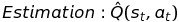
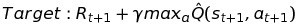
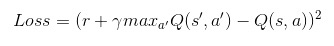
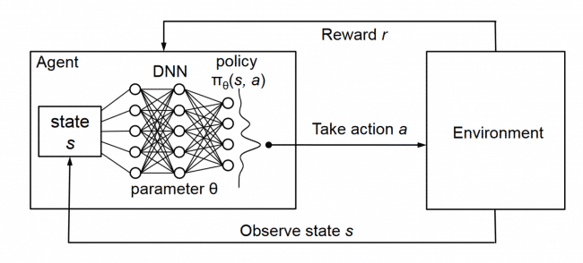
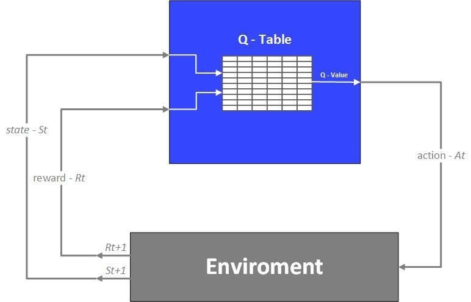
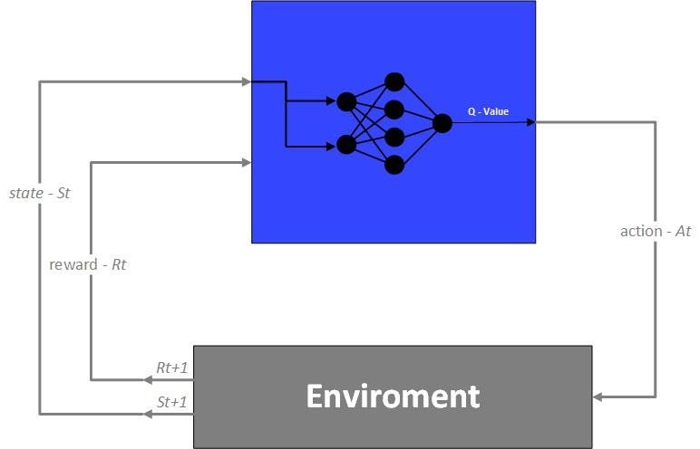
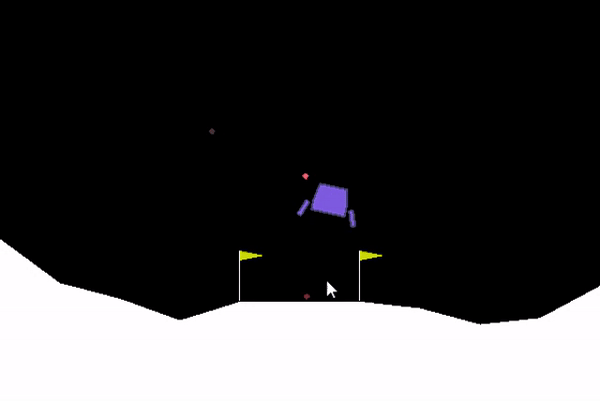
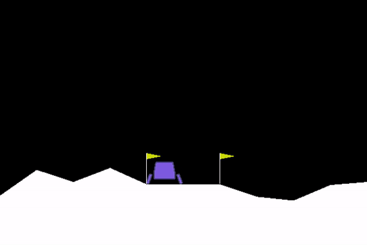
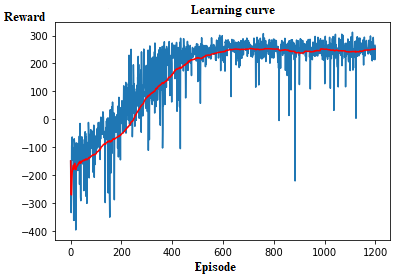

# Lunar-Lander-Double-Deep-Q-Networks
An AI agent that use Double Deep Q-learning to learn by itself how to land a Lunar Lander on OpenAI universe
# AI-Lunar-Laner-Lander-v2-Keras TF Backend
A Reinforcement Learning AI Agent that use Deep Q Network to play Lunar Lander

Algorithm Details and Hyperparameters:
===============
* Implementation: Keras TF Backend
* Algorithm: Deep Q-Network with a Double Fully connected layers
* Each Neural Network has the same structure: 2 Fully connected layers each with 128 nodes.
* Optimization algorithm: Adaptive Moment (Adam)
* Learning rate: **α = 0.0001**
* Discount factor: **γ = 0.99**
* Minimum exploration rate: **ε = 0.1**
* Replay memory size: **10^6**
* Mini batch size: **2^6**
 
**Commplete evolution (training process): https://www.youtube.com/watch?v=XopVALk2xb4&t=286s**
  

Description of the problem
===============

* The agent has to learn how to land a Lunar Lander to the moon surface safely, quickly and accurately.
* If the agent just lets the lander fall freely, it is dangerous and thus get a very negative reward from the environment.
* If the agent does not land quickly enough (after 20 seconds), it fails its objective and receive a negative reward from the environment.
* If the agent lands the lander safely but in wrong position, it is given either a small negative or small positive reward, depending on how far from the landing zone is the lander.
* If the AI lands the lander to the landing zone quickly and safely, it is successful and is award very positive reward.

Double Deep Q Networks (DDQN):
===============
* Since the state space is infinite, traditional Q-value table method does not work on this problem. As a result, we need to integrate Q-learning with Neural Network for value approximation. However, the action space remains discrete.

**Q-learning:** 
  

The equation above based on Bellman equation. You can try creating a sample graph of MDP to see intuitively why the Q-learning method converge to optimal value, thus converging to optimal policy.

* For Deep Q-learning, we simply use a NN to approximate Q-value in each time step, and then update the NN so that the estimate Q(s,a) approach its target: 
*  
*   
*   

**Difference between Q-learning and DQN:**   
  

  

* Purpose of using Double Deep Q-network: 
* To stablize the target Q-value and ensure convergence.
* Reference: https://arxiv.org/abs/1509.06461

  

  It has been proven mathematically and empirically that using Deep Q-Network approximation converges to optimal policy in reasonable amount of time.

Training Result:
===============
  
**Before training:**  

**After 800 games:**  

  
**Learning curve:**  
 

* The Blue curve shows the reward the agent earned in each episode.
* The Red curve shows the average reward from the corresponding episode in the x-axis and 100 previous episodes. In other words, it shows the average reward of 100 most current episodes.
* From the plot, we see that the Blue curve is much noisier due to exploration ε = 0.1 throughout the training process and due to the imperfect approximation during some first episodes of the training.
* Averaging 100 most current rewards produces much smoother curve, however.
* From the curve, we can conclude that the agent has successfully learned a good policy to solve the Lunar Lander problem, according to OpenAI criteria (the average point of any 100 consecutive episodes is at least 200).

  
