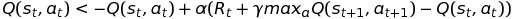
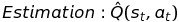
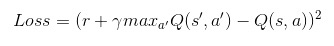
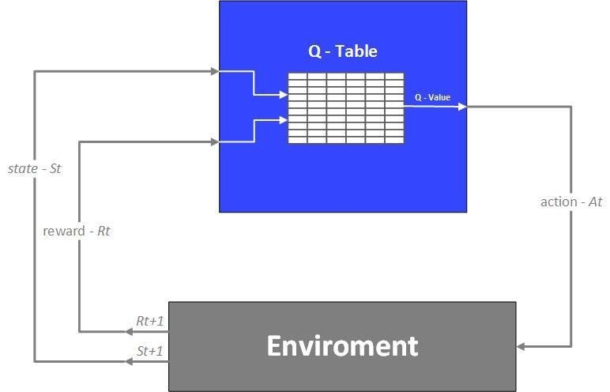
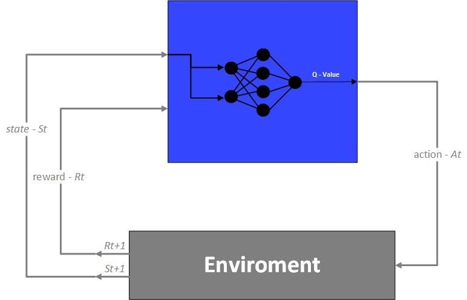

# Lunar-Lander-Double-Deep-Q-Networks
An AI agent that use Double Deep Q-learning to land a Lunar Lander on OpenAI universe
# AI-Lunar-Laner-Lander-v2-Keras TF Backend
A Reinforcement Learning AI Agent that use Deep Q Network to play Lunar Lander

* Implementation: Keras TF Backend
* Algorithm: Deep Q-Network with a Double Fully connected layers
* Each Neural Network has the same structure: 2 Fully connected layers each with 128 nodes.
* Optimization algorithm: Adaptive Moment (Adam)
* Learning rate: alpha = 0.001
* Discount factor: gamma = 0.99
 
**Description**

* The agent has to learn how to land a Lunar Lander to the moon surface safely, quickly and accurately.
* If the agent just lets the lander fall freely, it is dangerous and thus get a very negative reward from the environment.
* If the agent does not land quickly enough (after 20 seconds), it fails its objective and receive a negative reward from the environment.
* If the agent lands the lander safely but in wrong position, it is given either a small negative or small positive reward, depending on how far from the landing zone is the lander.
* If the AI lands the lander to the landing zone quickly and safely, it is successful and is award very positive reward.

* Since the state space is infinite, traditional Q-value table method does not work on this problem. As a result, we need to integrate Q-learning with Neural Network for value approximation. However, the action space remains discrete.

**Q-learning:** 
  

The equation above based on Bellman equation. You can try creating a sample graph of MDP to see intuitively why the Q-learning method converge to optimal value, thus converging to optimal policy.

* For Deep Q-learning, we simply use a NN to approximate Q-value in each time step, and then update the NN so that the estimate Q(s,a) approach its target: 
*  
*   
*   

**Difference between Q-learning and DQN:**   
  

  

  It has been proven mathematically and empirically that using this approximation, the algorithm with converge to optimal policy in reasonable amount of time.

  
